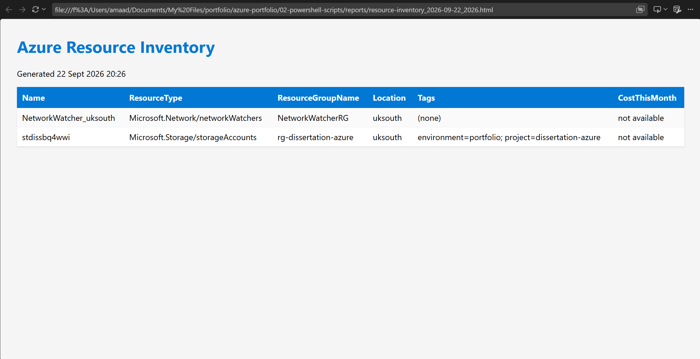

# Azure Resource & Cost Inventory Report

A PowerShell script that connects to Azure, inventories every resource in a subscription, merges in actual cost data per resource, and exports the result as both CSV and a styled HTML report. I built this to actually use myself for keeping an eye on spend, not just as a demo script.

## Features

- Full resource inventory across every resource group in the subscription (`Get-AzResource`)
- Actual cost per resource for the current month, via the Cost Management Query API
- Tag flattening, so hashtable tags get rendered as a readable `key=value; key=value` string
- Dual export: CSV for spreadsheets or further analysis, and a styled, screenshot-ready HTML report
- Parameterised (`-SubscriptionId`, `-OutputPath`) rather than hardcoded, so it's actually reusable
- Error handling at every real failure point: auth, subscription switch, resource fetch, cost fetch, file export

## Usage

```powershell
# Requires an active Azure session
Connect-AzAccount

# Run against whichever subscription is currently active
.\Get-AzureResourceInventory.ps1

# Or target a specific subscription and output location explicitly
.\Get-AzureResourceInventory.ps1 -SubscriptionId "00000000-0000-0000-0000-000000000000" -OutputPath "C:\Reports"
```

Outputs land in a `reports/` folder next to the script by default, each run timestamped so nothing gets silently overwritten.

## Sample output



## A decision worth explaining

I first tried `Get-AzConsumptionUsageDetail`, the older Azure Consumption API. It failed with a `BadRequest` on this subscription. That API is built mainly around Enterprise Agreement and Microsoft Customer Agreement billing accounts, and it doesn't reliably support Pay-As-You-Go subscriptions like mine. I switched to the Cost Management Query API instead, called directly via `Invoke-AzRestMethod` since there's no dedicated cmdlet module installed for it. This is the same API that powers the Cost Analysis page in the Azure Portal, it's actively supported across all subscription types, and it's the direction Microsoft is steering people toward generally.

One thing the tool itself surfaced while I was testing it: repeatedly destroying and recreating infrastructure (which happened a lot during Project 1) fragments cost history across multiple resource IDs. A resource's predecessor can still show accrued cost under its old, now-deleted ID, while the current live resource shows "not available" until its own usage gets processed. The script reports that honestly, an explicit "not available" rather than a misleading £0, instead of hiding the gap.

## Cost notes

This script has no infrastructure cost of its own. It only reads existing Azure data via API calls and doesn't provision anything. Running it repeatedly costs nothing beyond a small amount of API request volume, well within any subscription's free management-plane allowances.

## Tech stack

PowerShell 7, Az.Accounts, Az.Resources, Azure Cost Management REST API (via `Invoke-AzRestMethod`)
