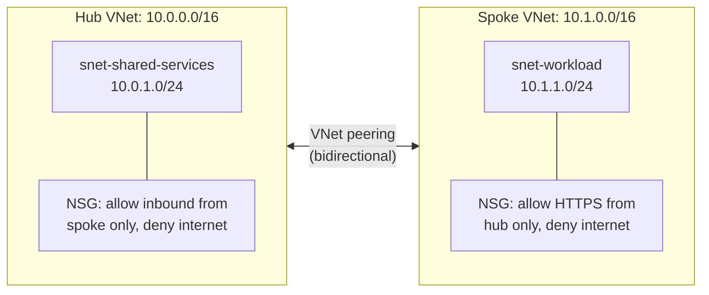
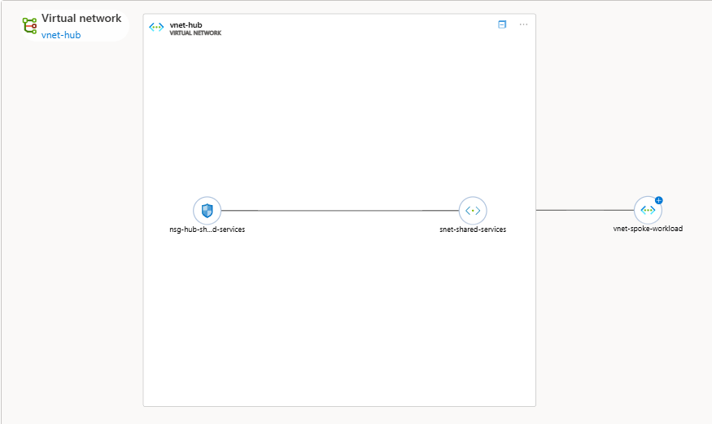

# Virtual Network Topology (Hub-and-Spoke)

A hub-and-spoke VNet architecture on Azure, built entirely in Terraform. A hub network for shared services, peered to a spoke network for workloads, with NSGs actually enforcing least-privilege traffic control between them rather than just relying on the defaults.

## What's here

- One hub VNet (`10.0.0.0/16`) with a shared-services subnet
- One spoke VNet (`10.1.0.0/16`) with a workload subnet
- Bidirectional VNet peering connecting them
- NSGs on both subnets: the hub only accepts inbound traffic from the spoke, the workload subnet only accepts HTTPS from the hub, everything else from the internet is explicitly denied

## Architecture



I picked a hub-and-spoke design because it centralises where you'd put shared security controls (a firewall, DNS, monitoring in a real setup) instead of connecting every workload network directly to every other one, which stops scaling once you have more than a couple of networks.

## Why the NSG rules are explicit rather than relying on defaults

Azure NSGs already deny internet inbound by default, so the `Deny-Internet-Inbound` rules I added aren't strictly required to get the same behaviour. I added them anyway, on purpose, because an explicit deny rule is documented and auditable in the Terraform itself, while an implicit default rule is easy to forget exists at all if someone's reviewing the config later. Same reasoning behind scoping the allow rules to specific source address ranges (`10.1.0.0/16`, `10.0.0.0/16`) instead of leaving them broad.

## Validation

Confirmed the peering is actually working, not just that Terraform reported success, using:

```bash
az network vnet peering list --resource-group rg-vnet-topology --vnet-name vnet-hub --output table
az network vnet peering list --resource-group rg-vnet-topology --vnet-name vnet-spoke-workload --output table
```

Both directions show `PeeringState: Connected` and `PeeringSyncLevel: FullyInSync`.

## Screenshot

Azure Portal's topology view, confirming the peering visually rather than just trusting Terraform's own output:



## Cost notes

**Actual spend: £0.00.**

VNets, subnets, NSGs and VNet peering are all free Azure resources with no billing meter attached to them at all. You'd only start paying here if a VPN Gateway or Azure Firewall got added to the hub, or once actual compute (VMs) got deployed into the subnets and started generating data transfer. Confirmed this using the Project 2 inventory script against this resource group too, everything shows correctly with no cost recorded, which matches expectations rather than being a "not processed yet" gap like Project 1's storage account was.

## Tech stack

Terraform, Azure Virtual Network, Azure Network Security Groups, Azure CLI (for validation)
