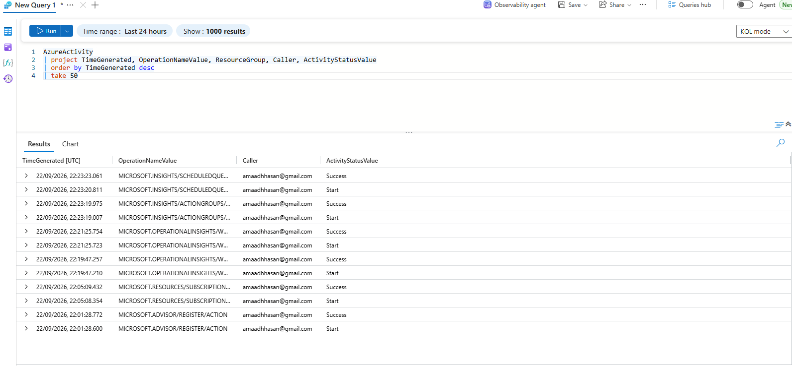
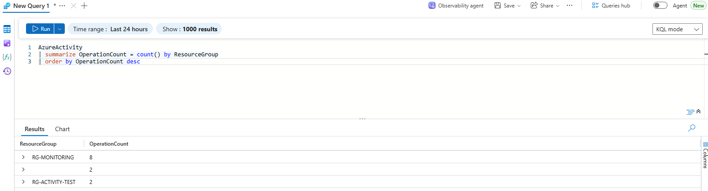

# Monitoring and Alerting Dashboard

A Log Analytics setup that actually tells me when something's wrong, not just infrastructure sitting there. Built with Terraform: a workspace collecting real activity data, KQL queries to search through it, and an alert rule that emails me when a failed operation actually happens.

## What's here

- Log Analytics workspace (`law-monitoring-dashboard`)
- Two diagnostic settings feeding it real data: the subscription's Activity Log, and one of the NSGs from Project 3
- `queries.kql`: 3 real KQL queries (recent activity, activity grouped by resource group, failed operations only)
- An alert rule that runs the failed-operations query every 15 minutes and emails me if it finds anything

## Why the Activity Log, not just the NSG

I originally planned to rely only on the NSG's own logs, but realised those only generate entries when actual network traffic hits the NSG's rules, and there's no VM or compute behind this topology, so there'd be nothing to see. The subscription's Activity Log records every real management action (every `terraform apply`, every resource created or changed), so it's guaranteed to have real data the moment it's wired up. I kept the NSG diagnostic setting too since it's still a valid thing to demonstrate, but the Activity Log is doing the actual work in this project.

## A real gap I hit testing this

The first time I ran the KQL queries, all 3 came back empty. Not a mistake, a diagnostic setting only captures activity from the point it's created onward, not retroactively, so everything I'd built earlier that day (Projects 1 through 4) never got logged here. I triggered a small test action (creating an empty resource group) after the diagnostic setting existed, waited about 10 minutes for it to actually flow through, and then the queries worked properly.

## Sample query results

Recent activity, unfiltered:

Activity grouped by resource group:

## Cost notes

Cost data hadn't processed yet by the time I checked (same reporting lag covered in Project 1 and Project 2's write-ups), so I can't quote an exact figure here. Based on how these resources are actually billed though, this should land close to £0. Log Analytics gives the first 5GB of data ingested per month free across the whole subscription, and this project generates a tiny amount of activity log data, nowhere near that limit. Action groups and scheduled query rules at this low a check frequency carry negligible cost too. I'll come back and update this with the real figure once it's had time to process.

## Tech stack

Terraform, Azure Log Analytics, KQL, Azure Monitor (Action Groups, Scheduled Query Rules)
