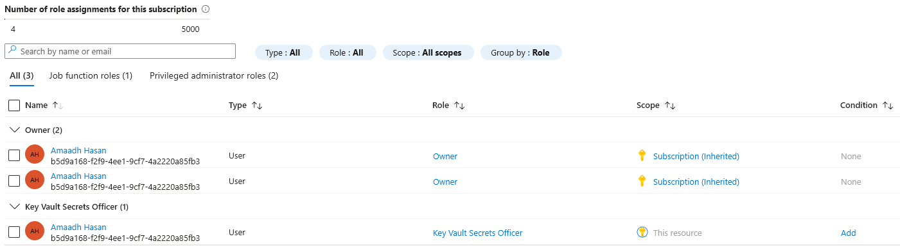

# Azure Key Vault Integration

A Key Vault holding a secret, with access controlled through Azure RBAC rather than a hardcoded credential or the older vault-specific access policy model. Built with Terraform.

## What's here

- A Key Vault with RBAC authorisation enabled (`enable_rbac_authorization = true`), so permissions on it work the same way as permissions on any other Azure resource, not through a separate vault-only system
- A secret stored in it
- A role assignment granting the "Key Vault Secrets Officer" role, scoped to just this vault

## Runbook: setting this up from scratch

1. Deploy the Terraform (`terraform init`, `terraform plan`, `terraform apply`) with a `terraform.tfvars` file supplying `secret_value`, kept out of git since it's a real value, not something that belongs in committed code.
2. Terraform creates the vault, then grants the deploying identity the Secrets Officer role, then creates the secret, in that order, using `depends_on` to guarantee the role assignment finishes propagating before the secret write is attempted (without it, the secret creation can fail on a permissions error even though the role assignment technically exists).
3. Confirm read access actually works:
   ```bash
   az keyvault secret show --vault-name <vault-name> --name example-secret --query value -o tsv
   ```
4. To grant a different identity access later (an App Service's managed identity, another user, a service principal), assign it the same "Key Vault Secrets Officer" or the more limited "Key Vault Secrets User" role (read-only, no ability to create or delete secrets), scoped to the vault, the same pattern as step 2.

## Why RBAC instead of access policies

Key Vault historically used its own separate permission system, "access policies", specific to vaults and not connected to normal Azure RBAC at all. Newer vaults can use standard RBAC role assignments instead, the same system controlling access to storage accounts, resource groups, and everything else in this portfolio. Using RBAC here keeps permission management consistent across the whole subscription instead of having Key Vault be a special case with its own separate rules.

## Why purge protection is off

Purge protection stops a deleted vault from being permanently removed for a mandatory retention window, even if you want it gone. A real production vault holding real secrets would likely want that on. Given how often infrastructure in this portfolio gets destroyed and rebuilt, leaving it off here is deliberate, not an oversight, a locked vault would actively get in the way of that workflow.

## Screenshot

The RBAC role assignment, proof access is scoped to just this vault, not the whole subscription:



## Cost notes

Cost data hadn't processed yet by the time I checked, same reporting lag as every other project in this portfolio. Key Vault's standard tier bills per operation (reading or writing a secret) at a fraction of a penny each, and this project only performs a handful of operations total, so the real figure should land close to £0 once it processes.

## Tech stack

Terraform, Azure Key Vault, Azure RBAC, Azure CLI (for validation)
