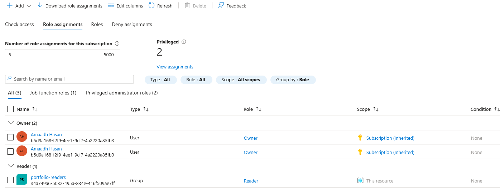
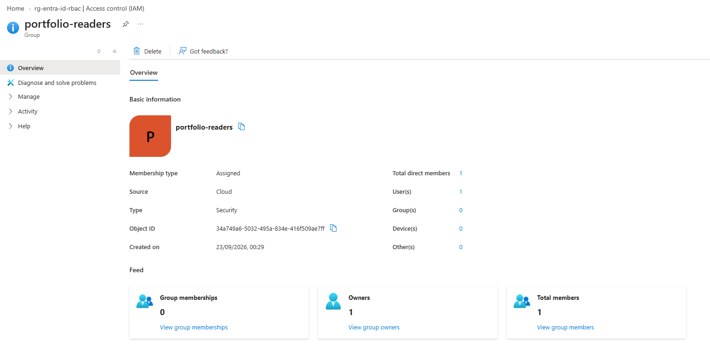

# Entra ID and RBAC Setup

An Entra ID security group with an Azure RBAC role assigned to the group itself, not to an individual user. This is the standard pattern for managing access as a team grows, add someone to the group and they inherit access, remove them and it's gone, without touching the role assignment itself.

## What's here

- An Entra ID group (`portfolio-readers`)
- Group membership managed as its own separate resource, not baked into the group definition
- A "Reader" role (view-only, no changes allowed) assigned to the group, scoped to one resource group

## Why group-based access instead of assigning roles to a user

Projects 1, 5, and 6 all assigned RBAC roles directly to an individual identity, my user account or a service principal. That works fine at small scale but doesn't hold up as more people need access, you'd end up creating a new role assignment for every person on every resource, with no single place to see who has access to what without checking each resource individually. Putting the role on a group instead means membership is the only thing that changes when someone joins or leaves, and it's visible in one place.

## A real constraint worth documenting, not working around

The original plan for this project included Conditional Access policies, custom sign-in rules like requiring MFA from unrecognised locations. Building those needs Entra ID Premium P1 licensing, which this tenant doesn't have, it's a free "Default Directory" auto-created for a personal Azure subscription. Rather than fake something the tenant can't actually support, I'm documenting the real constraint here. What this tenant does have is Security Defaults, the free-tier baseline that enforces MFA for everyone with no customisation possible. I already went through registering MFA properly under Security Defaults back at the start of Project 1, when `az login` kept failing with an AADSTS530035 error until MFA was actually set up, that's the real, lived version of "identity architecture decisions" this project is meant to demonstrate, not something built new for this write-up.

## Verified working

```bash
az role assignment list --resource-group rg-entra-id-rbac --output table
```

Shows `Reader` assigned to `portfolio-readers` (the group), not to my individual account.

## Screenshots

Role assignment, proof access is on the group, not a person:


The group itself:


## Cost notes

Cost data hadn't processed yet by the time I checked, same reporting lag as every other project here. Entra ID groups and RBAC role assignments have no cost at all, they're identity and access management, not billable resources, so this project's real spend is £0, not just "close to it."

## Tech stack

Terraform, Entra ID (Azure AD), Azure RBAC, Azure CLI (for validation)
